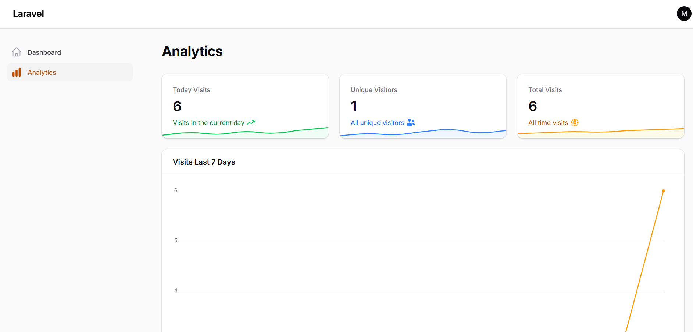
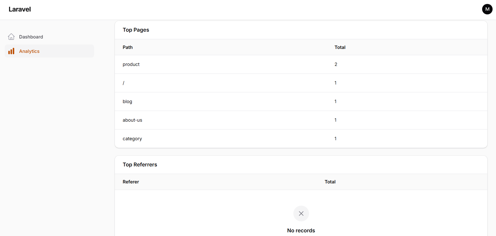

# Analyze Website Package

## Quick Summary

This package helps in tracking and analyzing website visits. It records information about each visit, such as the visited page, visitor information, and the browser used.

## Installation

You can install the package via composer:

```bash
composer require minabeter/analyze-website
```

run php artisan migrate

Publish the config file with:

```bash
php artisan vendor:publish --tag=analyze-website-config
```

This will create a `config/analyze-website.php` file in your project.

## Usage

To set up the package correctly, please follow these steps:

1.  **Add Service Provider:**
    In your `bootstrap/providers.php` file, add the following line after `AppServiceProvider::class`:

    ```php
    Mina\AnalyzeWebsite\AnalyzeWebsiteServiceProvider::class,
    ```

2.  **Add Middleware:**
    In your `bootstrap/app.php` file, within the `web` middleware group, add `TrackVisit::class`:

    ```php
    ->withMiddleware(function (Middleware $middleware): void {
        $middleware->web(append: [
            \Mina\AnalyzeWebsite\Middleware\TrackVisit::class,
            // ... other middleware
        ]);
    })
    ```

3.  **Configure Driver:**
    In your `.env` file, add the following to specify the driver for analytics. You can choose between `database`, `queue`, or `redis`.

    ```dotenv
    ANALYTICS_DRIVER=database
    ```

    -   **`database`**: (Default) Saves visit data directly to the database.
    -   **`queue`**: Pushes visit data to a queue for background processing. Make sure your queue worker is running.
    -   **`redis`**: Caches visit data in Redis for high performance.

4.  **Redis Driver Setup:**
    If you choose to use the `redis` driver, you need to schedule a command to flush the cached data to the database periodically.

    In your `app/Console/Kernel.php`, add the following to the `schedule` method:

    ```php
    $schedule->command('analytics:flush')->everyMinute();
    ```

5.  **Filament Integration:**
    To display the analytics dashboard in your Filament admin panel, you need to add the `AnalyzeWebsitePlugin` to your panel provider.

    In your panel provider file (e.g., `app/Providers/Filament/AdminPanelProvider.php`), add the following to the `plugins` method:

    ```php
    ->plugins([
        \Mina\AnalyzeWebsite\Filament\AnalyzeWebsitePlugin::make()
    ])
    ```

    This will add the analytics page to your Filament admin panel, where you can view the collected data.

    
    

